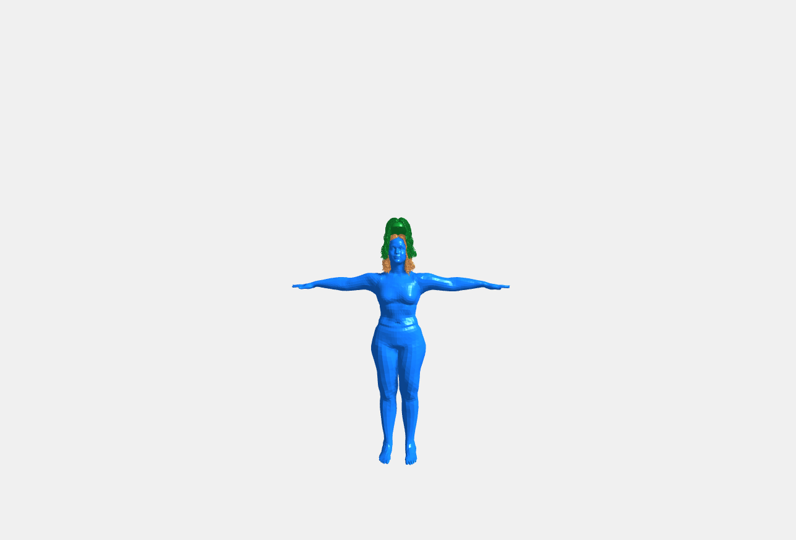
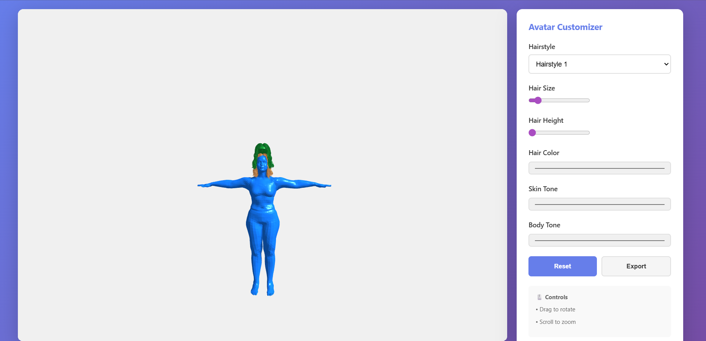

3D Avatar Customizer

A real-time 3D avatar customizer built using Three.js, allowing users to modify hairstyles, hair size, hair color, skin tone, and body tone interactively. Users can rotate, zoom, and export the avatar view as an image.

Architecture & Workflow

The application is designed with a modular 3D rendering and customization workflow:

1. Scene & Renderer
Three.js creates the 3D scene, camera, and renderer.
Lighting includes ambient light for general illumination and directional light for shadows and highlights.
The scene background is set with a neutral color for clarity.
2. Avatar Model & Parts
The base avatar (avatar.glb) is loaded using GLTFLoader.
Avatar parts include:
Base body/skin – supports skin and body color changes.
Hair – multiple hairstyles (hair1.glb, hair2.glb) can be dynamically swapped.
Each part is stored in a avatarParts object for easy access and updates.
3. Customization Logic
Hair Style & Size
Select hairstyle from dropdown.
Adjust hair scale (size) and height with sliders.
Colors
Hair color, skin tone, and body tone are adjustable via color pickers.
Reset & Export
Reset restores default colors and hairstyle.
Export saves the current 3D view as a PNG image.
4. Interaction
Mouse drag to rotate the avatar.
Scroll wheel to zoom in/out.
Changes are applied in real-time to the avatar materials.
5. Loading & Caching
Models are loaded asynchronously with GLTFLoader.
Previously loaded models are cached in gltfCache to improve performance.
A loading overlay displays while the avatar is being prepared.

